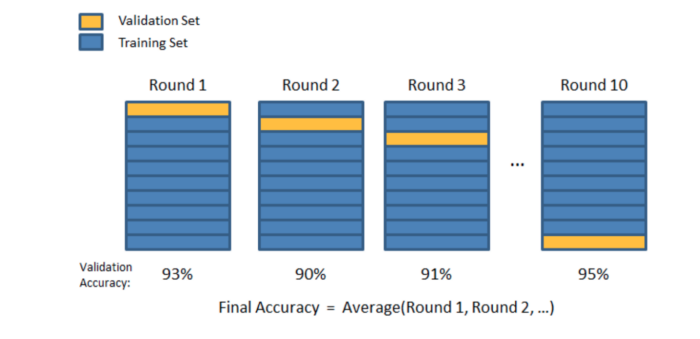

# credit-approval-ml
Machine Learning using [Credit Approval Data Set](https://archive.ics.uci.edu/ml/datasets/credit+approval)

This file concerns credit card applications. All attribute names and values have been changed to meaningless symbols to protect the confidentiality of the data.
This will still suit our purposes as a demonstration dataset since we are not using the data to develop actual credit screening criteria. 

This dataset is interesting because there is a good mix of attributes -- continuous, ordinal, nominal with small numbers of values, and nominal with larger numbers of values. There are also a few missing values.

## 1.  Attribute Information:

````
     A1:   b, a.
     A2:   continuous.
     A3:   continuous.
     A4:   u, y, l, t.
     A5:   g, p, gg.
     A6:   c, d, cc, i, j, k, m, r, q, w, x, e, aa, ff.
     A7:   v, h, bb, j, n, z, dd, ff, o.
     A8:   continuous.
     A9:   t, f.
     A10:  t, f.
     A11:  continuous.
     A12:  t, f.
     A13:  g, p, s.
     A14:  continuous.
     A15:  continuous.
     A16:  +,-         (class attribute)
````

## 2.  Missing Attribute Values:

37 cases (5%) have one or more missing values.

The missing values from particular attributes are:

````
     A1:  12
     A2:  12
     A4:   6
     A5:   6
     A6:   9
     A7:   9
     A14: 13
````

## 3.  Class Distribution
   
````
     +: 307 (44.5%)
     -: 383 (55.5%)
````

We are going to use supervised learning models, mainly logistic regression with KFold and GridSearch cross-validation and figure out their impacts on accuracy.


## 4. The steps expected are as follows:

    1. Load data and inspect the structure and the data types of the data set.
    2. Clean the data.
    3. Handle missing data.
    4. Preprocess the data.
    5. Basic data visulaization.
    6. Feature Scaling.
    7. Split data.
    8. Model data.

### Missing data handling:

    1. Remove rows with missing data.
    2. Fill continuous data with columns' mean/median values and categorical data with columns' most frequent category.
    3. Fill based on predictive models between mostly correlated columns.
    4. Fill using unsupervised learning.
    5. Fill using deep learning.
    6. Use Algorithms that support missing values.

#### 1. Remove rows with missing data.

* Pros:
  * A model trained with the removal of all missing values creates a robust model.
* Cons:
  * Loss of a lot of information.
  * Works poorly if the percentage of missing values is excessive in comparison to the complete dataset.

#### 2. Fill continuous data with columns' mean/median values and categorical data with columns' most frequent category.

* Pros:
  * Prevent data loss which results in deletion of rows or columns.
  * Works well with a small dataset and easy to implement.
* Cons:
  * Can cause data leakage.
  * Does not factor the covariance between features (for continuous ones).

#### 3. Fill based on predictive models between mostly correlated columns.
Using linear regression for continuous data and association rules by Apriori for categorical data.

* Pros:
  * Gives a better result than earlier methods.
  * Takes into account the covariance between the missing value column and other columns.
* Cons:
  * Considered only as a proxy for the true values.

#### 4. Fill using unsupervised learning.
Using k-nearest neighbors imputer.

* Pros:
  * Support more non-linearity between data, as it doesn't need a strong correlation  
  * Takes into account the covariance between the missing value column and other columns.
* Cons:
  * Considered only as a proxy for the true values.

#### 5. Fill using deep learning.
Using Datawig which is a library that learns ML models using Deep Neural Networks to impute missing values in the datagram.

* Pros:
  * Works very well with categorical, continuous, and non-numerical features.
  * Quite accurate compared to other methods.
  * It supports both CPUs and GPUs.
* Cons:
  * Still can be quite slow with large datasets.

#### 6. Use Algorithms that support missing values.

* Pros:
  * No need to handle missing values in each column as ML algorithms will handle it efficiently.
* Cons:
  * No implementation of these ML algorithms in the scikit-learn library.

### Data normalization:

#### Normalization
It is the process of rescaling the values between [0, 1].
Image for post


#### Why normalization?
* Normalization makes training less sensitive to the scale of features, so we can better solve for coefficients. Outliers are gone, but still remain visible within the normalized data.
* The use of a normalization method will improve analysis for some models.
* Normalizing will ensure that a convergence problem does not have a massive variance, making optimization feasible.

#### Standardization
It is the process of rescaling the features so that they’ll have the properties of a Gaussian distribution with a mean of 0 and a standard deviation of 1.


#### Why standardization?
* Compare features that have different units or scales.
* Standardizing tends to make the training process well behaved because the numerical condition of the optimization problems is improved.

#### Differences?
* When using standardization, your new data aren’t bounded (unlike normalization).
* Use normalization when you don’t know the distribution of your data or you know it is not Gaussian.
* Use standardization if your data has a Gaussian distribution.
Sometimes, when normalization does not work, standardization might do the work.

#### Log transformation
In the case of positive skewness, log transformations usually work well.

### Data splitting:

#### So in theory, we need to: 
1. Split our data into k different subsets (or folds).
2. Use k-1 subsets to train our data and leave the last subset (or the last fold) as test data.
3. Average the model against each of the folds.
4. Finalize our model.
5. Test it against the test set.



#### Impact of increasing the number of folds:
* Pros:
  * Reduce error due to bias.
* Cons:
  * Increase error due to variance.
  * Increase computational cost.
